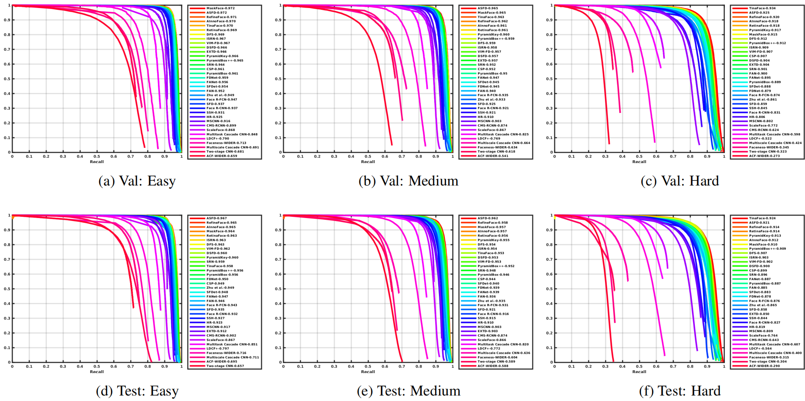

# TinaFace: Strong but Simple Baseline for Face Detection

## Introduction
Providing a strong but simple baseline method for face detection named TinaFace. The architecture of TinaFace is shown below. See [paper](https://arxiv.org/abs/2011.13183) for details.


## Data

### WIDER FACE
a. Convert raw data to PASCAL-VOC format by [this tool](https://github.com/akofman/wider-face-pascal-voc-annotations)

## Train
a. Follow the official instructions on [vedadet](https://github.com/Media-Smart/vedadet) 

## Evaluation
a. Back to `${vedadet_root}`

b. Run following instruction
```shell
python config/trainval/tinaface/test_widerface.py configs/trainval/tinaface/tinaface.py weight_path
```
widerface txt file will be generated at `${vedadet_root}/eval_dirs/tmp/tinaface/`, and then download the [eval_tool](http://mmlab.ie.cuhk.edu.hk/projects/WIDERFace/support/eval_script/eval_tools.zip) to evaluate the WIDERFACE performance.

## Results and Models

### WIDERFACE

| Backbone  |  size  | AP50(VOC12) | Easy | Medium | Hard | Download |
|:---------:|:-------:|:-------:|:--------:|:--------------:|:------:|:--------:|
| ResNet-50 | (1100, 1650) |   0.923   | 0.963  |  0.957   |  0.930  | model weights on [Google Drive](https://drive.google.com/file/d/1zU738coEVDBkLBUa4hvJUucL7dcSBT7v/view?usp=sharing) and [Baidu Drive(z4gu)](https://pan.baidu.com/s/12flU7IX-2pNRKTZEeYiQ1Q)|


